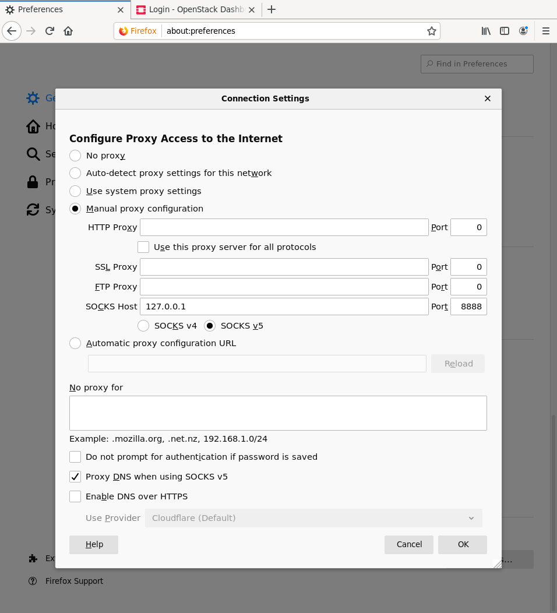
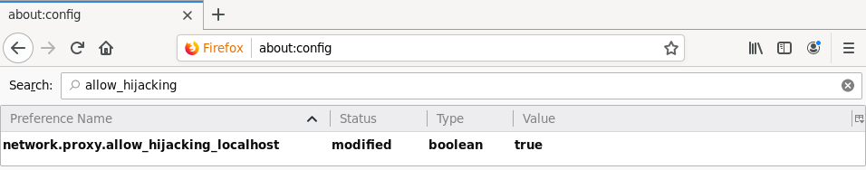

* Exercise 02 - Setup an SSH tunnel and use it as a socks proxy in a web Browser
  - Description :: Setup a browser to use SSH based Socks Proxy tunnel. Create a tunnel from your laptop to the Lan VM. Finally verify that you, _and only you_, are able to reach your VM behind the firewall using this setup.

* Solutions and Instructions
** Configure a browser to use a socks proxy
This section depends heavily on your browser and even on your browser version, alternatively you can use an extensions, see below.

In order to properly start a SOCKS proxy server we need to identify the =$SOCKS_ADDR= and the =$SOCKS_PORT= where it will listen for connections to proxies on the tunnel.

Given that the tunnel is setup on your laptop you can just make it listen on the loopback interface (=127.0.0.1=) and on a port of your choice from the high unprivileged port range, eg: =4444= or =8888=. Let's say we will use:

#+begin_example
$SOCKS_ADDR=127.0.0.1
$SOCKS_PORT=4444
#+end_example

*** Using a browser extension (preferred choice)
Modern versions of Firefox have support for [[https://addons.mozilla.org/en-US/firefox/addon/multi-account-containers/][Multi-Account Containers]] which allows you to separate your browsing contexts. Usually, the use case is to keep different types of browsing activities separate, enhancing privacy and organization. However, it can also be used to separate the browsing context of the SOCKS proxy.

To use the Multi-Account Containers extension to separate the browsing context of the SOCKS proxy, follow these steps:

1. Install the Multi-Account Containers extension from the provided link.
2. Create a new container for your SOCKS proxy usage.
3. Configure the container’s settings to use the SOCKS proxy address and port you set up earlier.

*** Configuring your browser
The examples are for a modern version of Firefox.

Optionally, you can create a profile in your preferred browser, for Firefox starts with:
#+begin_src sh
firefox --no-remote --ProfileManager
#+end_src

In Firefox under the network setting, add a SOCKS proxy with the address of the =$SOCKS_ADDR= and the port of the =$SOCKS_PORT= identified above.

In very recent versions of Firefox, you will also need to set =network.proxy.allow_hijacking_localhost= to =true= in =about:config=, see [[https://bugzilla.mozilla.org/show_bug.cgi?id=1535581][https://bugzilla.mozilla.org/show_bug.cgi?id=1535581]]

*** Using curl

You can also use curl to test the connection. The following command will use the SOCKS proxy to connect to the Lab VM. The =-x= flag is used to specify the proxy address and port.

#+begin_src sh
  curl -x socks5h://$SOCKS_ADDR:$SOCKS_PORT http://localhost
#+end_src

** Launch the tunnel
Launch an SSH connection with SOCKS support. Read [[https://en.wikipedia.org/wiki/SOCKS][here]] to better understand what a SOCKS Proxy is and how it works.
#+begin_src sh
  ssh -D ${SOCKS_ADDR}:${SOCKS_PORT} -p LAB_VM_PORT disi@LAB_VM_URL
#+end_src

** Create a dummy service on the Lab VM
The below simple snippet will expose a web server that shows the content of the file =index.html=.
#+begin_src sh
  mkdir ws
  cd ws
  echo "Hello from FCC Lab Web Server" > index.html
  python3 -m http.server
#+end_src

Identify the exposed port (it should be the port =8000=) and open on your modified browser the following URL: http://localhost:8000.

What do you see in the browser? What do you see in the terminal? Where are the connections coming from?
